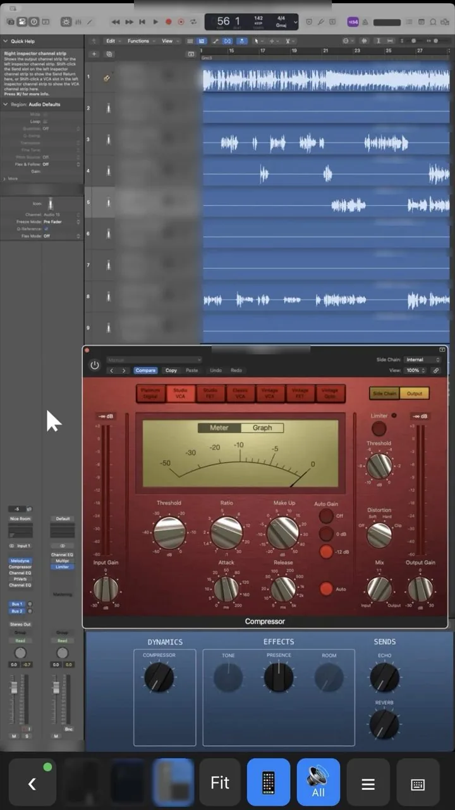
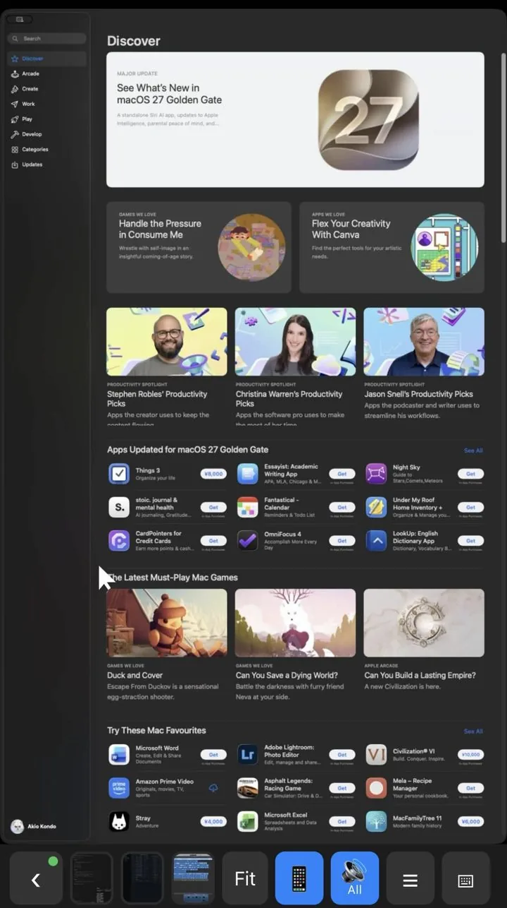
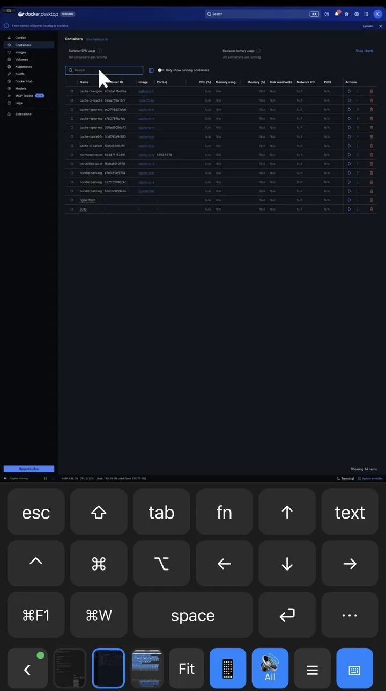

# mac-window-remote

<p>
  
  
  
</p>

**Your Mac's windows, in your pocket — see them, touch them, hear them.**

- **One window, full focus:** pick any Mac window and use it on your iPhone (or a PC browser) as sharp, low-latency video, with a trackpad-style pointer, keyboard, shortcuts, and menus.
- **Private by design:** it runs only inside your own Tailscale network, with no cloud relay, no accounts, and no pairing codes.
- **More than a mirror:** the Mac's sound on your phone, plug-in and floating windows included, copy on the Mac and paste on your device, and files downloaded or uploaded in a tap.

## What you can do with it

- **Still lugging your MacBook around? Why?** Leave it on the desk. Its apps now ride in your pocket, and your shoulders will send you a thank-you note.
- **Work from bed. (Warning: you may never get up again.)** Apart from meetings, pretty much the whole workday now fits on an iPhone. Your desk chair misses you. Your pillow does not.
- **Mix in the bath.** Sit back in the tub, turn Logic Pro's plug-in knobs and faders on your iPhone, and hear the result through it, not the Mac's speakers.
- **Drive a desktop coding agent from anywhere.** Keep Cursor (or any desktop IDE / agent app) running on the Mac, and check its progress, answer its prompts, and type the next instruction from your phone.
- **Babysit long jobs.** Watch a render, export, build, or download, and click “OK” on the dialog that would otherwise have stalled it — from another room or outside.
- **Grab a file you forgot.** Browse the Mac, search by name, and download one file or a zip of several to your phone.
- **Drop a file into the Mac.** Send a photo or any file from the phone; its Mac path is pasted into the window you are using, ready for a chat box or a terminal.

## Features

- A resident macOS menu bar app captures a single selected window (ScreenCaptureKit), streams it to the phone as H.264 video over WebRTC, and injects clicks/keys (CGEvent).
- The iPhone side is a web app (Safari / Home Screen) served by the Mac app, reachable only inside your Tailscale tailnet over HTTPS.
- The phone works like a trackpad: one finger moves the Mac pointer (drawn as an arrow on the phone), tap clicks at the pointer, a two-finger tap right-clicks, two fingers scroll, a long-press starts a drag (tap to release), pinch zooms, and three fingers pan the zoomed view. Type with the iPhone keyboard (Japanese IME and dictation work, because only committed text is sent). ⌨︎ opens a key panel with esc, tab, arrows, F1–F12 (fn), and one-shot ⌘ ⌃ ⌥ ⇧ for shortcuts such as ⌘C and ⌃C, one-tap ⌘F1 and ⌘W (close the window), space and ⏎, and a ⋯ menu with 📋 Paste / 📋 Copy to Mac / 🖼 Image / 📎 File / ⌘Q (Copy to Mac puts this device's clipboard text on the Mac clipboard without pasting; 📎 uploads any file, up to 100 MiB, and pastes its Mac path); its text key opens the iPhone keyboard.
- The list screen (‹) has **Windows | Apps**: Apps shows the Mac Dock's apps (and other running apps) as icons; tap one to launch or bring it forward and view its front window.
- ☰ in the bottom bar lists the viewed app's menu bar menus (without the Apple menu) as a drill-down sheet; tap an item to run it on the Mac. Menus that an app fills only when opened show up empty.
- The viewed app's floating windows (plug-in editors, palettes) and windows it opens while you view it (Settings, dialogs) appear in the video next to the viewed window, and taps reach them.
- From a **desktop browser** the mouse points directly (the Mac cursor follows it; click, double-click, right-click, drag, wheel; a trackpad pinch or Ctrl + wheel zooms the view) and the physical keyboard types into the window (shortcuts by key position, text in your layout, IME commits). Keys the browser or OS keeps, such as ⌘Tab, ⌘Q, and ⌘W, cannot be captured; use the key panel's ⌘W and ⋯ ⌘Q, or the Mac's own switcher.
- ⋯ → **⬇︎ Download** browses the whole Mac filesystem (quick places, breadcrumbs, hidden-files toggle, file-name search) and saves the checked items to the iPhone or PC: one file as is, several items or a folder as one zip (up to 2 GB). It only reads files.
- Text you copy on the Mac while a device is viewing is offered to that device's clipboard: a focused desktop browser copies it at once, and otherwise a banner "📋 Copied on the Mac — tap to copy here" copies it with one tap (text only, up to 1 MiB; items that password managers mark as concealed are never sent).
- 🔊 in the bottom bar plays the Mac's sound on the iPhone instead of the Mac's speakers: **App** (the viewed window's app) or **All** (the whole Mac); 🔇 **Off** gives the sound back to the Mac. Needs macOS 14.2 or later.

## Status

**Revision 2**: open the page → pick a window → view as WebRTC video → zoom → trackpad-style pointer, clicks, scroll, drag → type. Custom key buttons are a later slice. The design is in [`docs/DESIGN.md`](docs/DESIGN.md).

## Honest constraints

- The Mac must be unlocked and its display awake. While you are viewing, the app keeps the display from sleeping because of idle time.
- Only windows that are on screen in the current Space can be picked. Minimized windows, hidden apps, and other Spaces are not listed.
- Viewing does not move windows, but operating does. Any click, scroll, or typing first brings the window to the front.
- The Mac's pointer really moves.
- macOS periodically asks a person at the Mac to confirm Screen Recording again.

## Requirements

- macOS 14 or later, and Xcode with Swift 6.3 or later
- iOS 16.4 or later (Safari or a Home Screen web app)
- Tailscale on the Mac and the iPhone, in the same tailnet, with **MagicDNS** and **HTTPS Certificates** enabled in the admin console

## Build and run

```sh
scripts/build-app.sh
open build/MacWindowRemote.app
```

The script signs ad-hoc by default. With an ad-hoc signature, macOS may ask again for Screen Recording and Accessibility after each rebuild. To keep those grants, sign with your Apple Development certificate (a free Apple ID is enough):

```sh
security find-identity -v -p codesigning     # pick one
CODESIGN_IDENTITY="<name of the identity>" scripts/build-app.sh
```

Development: `MWR_WEB_ROOT=$PWD/web build/MacWindowRemote.app/Contents/MacOS/MacWindowRemote` serves the web client from disk, so client edits need only a reload.

Tests: `cd mac && swift test`, and `node --test tests/web/*.test.mjs` for the gesture recognizer, the quick-switch slots, the key panel and its modifiers, and the Apps tab.

The app bundles [WebRTC](https://github.com/stasel/WebRTC) (`WebRTC.framework`, BSD-style license in `Contents/Resources/WebRTC-LICENSE`); `scripts/build-app.sh` embeds and signs it.

## Setup

1. Open the app. **Setup & Permissions** opens by itself.
2. Grant **Screen Recording**: click Request or Open Settings, and turn the app on. Then click **Relaunch**.
3. Grant **Accessibility** the same way.
4. In Terminal, run the command that Setup shows, once: `tailscale serve --bg http://127.0.0.1:8765`
5. On the iPhone, sign in to Tailscale with the **same account as the Mac** (the menu bar shows it as "Allowed: …"), and open the `https://…` address that `tailscale serve` prints in Safari. The window list opens. To use it from the Home Screen, choose Share → **Add to Home Screen**.
6. Keep the Mac unlocked while you use it remotely.
7. The first time you turn on 🔊 on the iPhone, macOS asks whether Mac Window Remote may record system audio: click **Allow** (System Settings → Privacy & Security → Screen & System Audio Recording). If the phone says "No audio: allow audio capture…", turn the app on there.

If macOS asks whether **MacWindowRemote** may accept incoming network connections, click **Allow**: the video goes directly between the Mac and the iPhone over UDP on the tailnet (WebRTC), not through `tailscale serve`. After a rebuild, macOS may also ask for Screen Recording and Accessibility again; switch the app's entry off and on in System Settings → Privacy & Security.

### Using it on cellular

Turn Tailscale on on both the Mac and the iPhone. No port forwarding and no STUN/TURN server are needed: WebRTC connects over the tailnet addresses, and Tailscale relays traffic itself when it cannot make a direct path (that adds latency). If the video does not start, the page says so and offers **Retry**.

The server listens on `127.0.0.1` only. It is reachable from the tailnet only through `tailscale serve`, and every request must come from the Tailscale login that owns this Mac: `tailscale serve` sends it in the `Tailscale-User-Login` header, and the app reads the owner from `tailscale status --json`. Other tailnet users, tagged devices, and direct local requests get "Not allowed: sign in to Tailscale as the Mac owner". To allow a different login, set it in Settings → **Allowed Tailscale login**.

## License

MIT, see [LICENSE](LICENSE).
